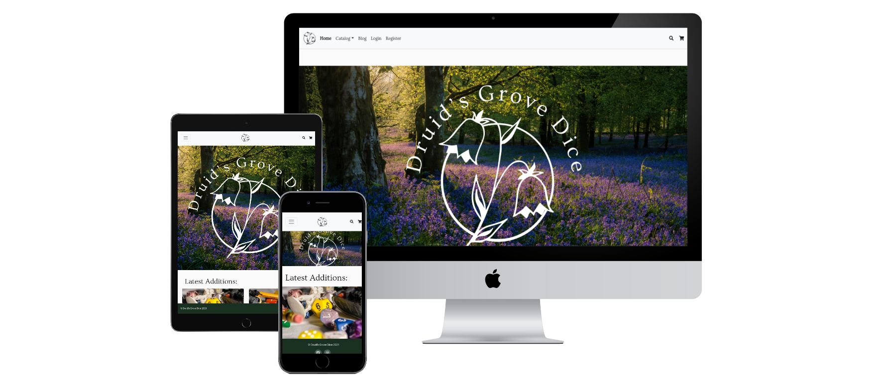
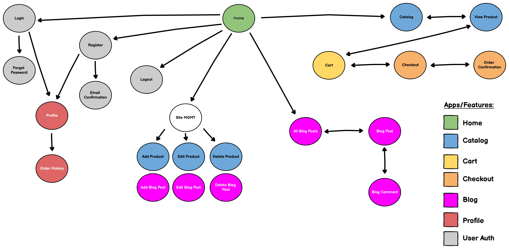

# Druid's Grove Dice


Druid's Grove Dice is an independent Irish dice maker inspired by nature, myth and magic. This site an online storefront and creator blog that aims to provide fans of tabletop role-playing games a place to find and purchase bespoke hand-made dice sets.

View the live site [here](https://druids-grove-dice.herokuapp.com/).



# Table of Contents

> 1.  [Project Goals](#project-goals)
> 2.  [UX](#ux)
> 3.  [Features](#features)
> 4.  [Technologies Used](#technologies-used)
> 5.  [Testing](#testing)
> 6.  [Deployment](#deployment)
> 7.  [Credits](#credits)
> 8.  [Acknowledgements](#acknowledgements)

# **Project Goals**
In recent years tabletop role-playing games have seen a huge surge in popularity, and more people than ever are carefully crafting characters to play and adventures to enjoy with their friends.

Druid's Grove Dice aims to provide these players with hand-made dice in a range of colors and themes, allowing them to further customize and personalize their gaming experiences.

**User Goals:**
- To browse and purchase custom dice for tabletop gaming.

**Site Owner Goals:**
- To display and sell custom made dice and wares.
- To communicate with customers, both potential and existing, to discuss upcoming products and projects.

# **UX**
## **User Stories**
The user stories for this site were divided into 5 broad categories, linked below:
1. [Navigation](#1-navigation)
2. [User Accounts](#2-user-accounts)
3. [Purchasing](#3-purchasing)
4. [Product Management](#4-product-management)
5. [Communication](#5-communication)

### **1. Navigation**
| ID         | As a…    | I want to…                             | So I can...                                         |
|------------|----------|----------------------------------------|----------------------------------------------------|
| US101      | Customer | View all available products            | Select products to purchase                        |
| US102      | Customer | Search products by name or description | Find a specific product to purchase                |
| US103      | Customer | View individual product details        | Learn more about it and decide if I want to buy it |
| US104      | Customer | View my order history                  | Refer back to my previous purchases                |
| US105      | Customer | Order and filter products              | Find a specific product to purchase                |

### **2. User Accounts**
| ID            | As a…     | I want to…                 | So I can...                                                                                 |
|---------------|-----------|----------------------------|--------------------------------------------------------------------------------------------|
| US201         | Site User | Register for an account    | Have a personalised account, and access different parts of the site   depending on my role |
| US202         | Site User | Login and logout           | Access my account securely                                                                 |
| US203         | Site User | Reset my password          | Securely regain access to my account if I forget my password                               |
| US204         | Customer  | Have a unique profile page | View my order history and saved delivery address, and update the address   if needed       |

### **3. Purchasing**
| ID         | As a…    | I want to…                                                     | So I can...                                               |
|------------|----------|----------------------------------------------------------------|----------------------------------------------------------|
| US301      | Customer | Easily add the desired type and number of items to the cart    | Select the correct items for purchase                    |
| US302      | Customer | View the items and their quantities in my cart before purchase | Make sure that I have selected the correct items         |
| US303      | Customer | Change the quantities of items in my cart before purchase      | Make changes to the cart's contents before checkout      |
| US304      | Customer | Enter payment and delivery information                         | Checkout easily, securely and with confidence            |
| US305      | Customer | View an order confirmation page on checkout                    | Confirm my order has gone through and is correct         |
| US306      | Customer | Receive a confirmation email on checkout                       | Keep a copy of the order confirmation for my own records |

### **4. Product Management**
| ID                 | As a…      | I want to…             | So I can...                                                      |
|--------------------|------------|------------------------|-----------------------------------------------------------------|
| US401              | Site Owner | Add products           | Make new products available for site users to view and purchase |
| US402              | Site Owner | Edit & update products | Change product names and descriptions as needed                 |
| US403              | Site Owner | Delete products        | Remove products from the store front as needed                  |

### **5. Communication**
| ID                 | As a…      | I want to…             | So I can...                                                   |
|--------------------|------------|------------------------|---------------------------------------------------------------|
| US501              | Site User  | View Blog Posts                    | Keep up to date with the latest news and products |
| US502              | Site Owner | Make Blog Posts                    | Provide updates on the business and new products  |
| US503              | Site Owner | Edit, Update and Delete Blog Posts | Provide more information, correct typos and mistakes and remove older posts|
| US504              | Site User | Leave comments on Blog Posts | Engage with the posted content, and interact with other users |

## **Design**

### Database Schema

Based on the user stories and goals above, the following schema was mapped out:


During development, some changes were made to these models to accomodate the needs of the project:
- **Order**: The `original_cart` and `stripe_pid` fields are not included in the final model, as they were originally intended for use with Stripe webhooks which were not implemented.
- **BlogPost**: The `date` field has been replaced by two fields, `created_on` and `updated_on`. This allows the site users to display both when a post was made, and how recently it has been updated or edited.
- **BlogComment**: The `comment_title` and `comment_body` fields have been consolidated into a `content` field, as decisions regarding the UX/UI rendered comment titles unnecessary.

### Layout
An initial rough layout of the site was then devised, as shown in the following information architecture diagram:



### Wireframes
*Initial wireframes for each of these pages can be found [here](docs/wireframes).*

### Color Scheme
The following color palette was chosen for the site:


These colors were chosen to tie in with the nature imagery displayed in the hero image (shown above). Muted colors are used to preserve the desired aesthetic while also ensuring the styling does not draw away the attention of the user from the site's content. 

In terms of accessiblity, the site's text is predominantly in a shade of black (#1C1A1A) against an off-white background (#FAFAFA). This gives a contrast ratio of 16.59:1 per [WebAIM](https://webaim.org/resources/contrastchecker/), well above the minimum needed to meet [WCAG AAA](https://www.w3.org/WAI/WCAG2AAA-Conformance) standards.

### Fonts
- [Ovo](https://fonts.google.com/specimen/Ovo#standard-styles) - Used in the site's brand logo, hero image and in page headers.
- [Goudy Bookletter](https://fonts.google.com/specimen/Goudy+Bookletter+1911#standard-styles) - Used in sub-headings and product titles.
- [Roboto](https://fonts.google.com/specimen/Roboto#standard-styles) - Used in product descriptions and for any pricing information.

# **Features**
## Authentication & Profiles
- Users can Register for accounts, and verify their emsail address.
- Users can Log in and out with ease.
- Users can reset their passwords via email.
- Users can view their individual Profile pages, where they can see their Order History and update their default delivery address.

## Shopping & Purchasing
- Users can browse all products in the Catalog.
- Users can use the dedicated Search modal which can be accessed via the navbar to search the database. Search terms are checked against the product names and descriptions.
- Users can order the products by price or by name.
- Users can filter the products by category.
- Users can choose a quantity of an item before adding to their cart.
- Users can go straight to checkout by clicking Buy Now instead of Add to Cart.
- In the shopping cart, users can change the quantity of items, or remove them altogether.
- At checkout, users can provide delivery and payment info to complete the purchase.
- Purchases are completed using Stripe 
- Upon purchase, the user is shown an Order Confirmation page, sent an Order Confirmation email and (if they have an account) the order is added to the order history on thei Profile.

## Product Management
- Site owners can add new products to the Catalog
- Site owners can edit the name, description, price and image of existing products. A placeholder image is displayed if none is provided.
- Site owners can delete products from the Catalog. Clicking the Delete button triggers a modal which asks the user if they are sure they wish to proceede.

## Blog
- Site Owners can add, edit and delete Blog Posts
- Logged in Users can leave comments on Blog Posts

## Features to Implement
- **Webhooks**: Stripe's webhooks have not been utilized in this site as they are not strictly necessary for the smooth running of the site. However, they are mentioned here as a potential feature to implement in the future as they would be way to build in some redundancy to the checkout process and capture orders that may otherwise be missed due to potential user error or connection issues.

# **Technologies Used**
Languages:
- [HTML5](https://developer.mozilla.org/en-US/docs/Web/HTML) - the pages of this site were designed using HTML.
- [CSS3](https://developer.mozilla.org/en-US/docs/Web/CSS) - the pages of this site were styled using CSS.
- [Javascript](https://developer.mozilla.org/en-US/docs/Web/JavaScript) - the interactive elements of this site were implemented using JavaScript.
- [Python](https://www.python.org/) - back-end functionality of the site was written in Python.

Frameworks:
- [Django](https://www.djangoproject.com/) - The Django framework was used to structure the site's back-end, handle database operations and pass information to and from the front-end.
- [Bootstrap](https://getbootstrap.com/) - Bootstrap was used to lay out and style the site's front-end, and aid in responsive design.
- [jQuery](https://jquery.com/) - jQuery was used to simplify and condense JavaScript, particularly for interacting with, and writing to, the DOM.

Databases:
- [MySQL](https://www.mysql.com/) - A MySQL database was used in development.
- [Heroku Postgres ](https://www.heroku.com/postgres) - A Heroku PostgreSQL database is used for the deployed site.

Packages & Extensions:
- [django-allauth](https://django-allauth.readthedocs.io/en/latest/index.html) - The site's user management is handled using django-allauth.

Tools - Development & Hosting:
- [Gitpod](https://www.gitpod.io/) - The site was developed using Gitpod as the development environment.
- [GitHub](https://github.com/) - Files for this project are hosted on it's [GitHub repository](https://github.com/kevinoc554/druidsgrovedice).
- [Heroku](https://www.heroku.com/home) - The live deployed version of the site is hosted on Heroku. 
- [Amazon AWS](https://aws.amazon.com/) (S3) - Media and static files for the project are hosted in an AWS S3 bucket.
- [Font Awesome](https://fontawesome.com/) - Font Awesome icons were used for the social media links in the footer, and throughout the checkout process.
- [Google Fonts](https://fonts.google.com/) - Google Fonts were used throughout the project.
- [Favicon Generator](https://www.favicongenerator.com/) - Favicon Generator was used to create and size the favicon for the site.

Tools - Documentation:
- [Balsamiq](https://balsamiq.com/wireframes/) - Balsamiq was used to create the initial wireframes and diagrams.
- [Coolor](https://coolors.co/) - Coolor was used to generate the color palette image.
- [DBDiagram](https://dbdiagram.io/home/) - DBDiagram was used to generate the database model image.

# **Testing**
*Full details of testing and bugs can be found [here](docs/TESTING.md).*

# **Deployment**
# Deployment

- This site was developed in [Gitpod](https://www.gitpod.io/), committed and pushed to [Github](https://github.com/), and deployed on [Heroku](https://www.heroku.com/).
- At the time of submission, there are no differences between the development version and deployed version of the site.

## To run this site locally:
* Navigate to the site's [Github Repository](https://github.com/kevinoc554/druidsgrovedice).
* Click on the **Code** button.
* Copy the URL under **Clone with HTTPS** by clicking on the **Copy** button.
* Open the terminal in your IDE, and navigate to the desired directory.
* Type `git clone` into the terminal, and paste in the copied URL, e.g.,  
``git clone https://github.com/kevinoc554/druidsgrovedice.git``
* Press enter to clone the repository.
* Set the Environment Variables, as outlined below.
* Install the required packages using `pip install -r requirements.txt`.
* Run the server using `python manage.py runserver`

### Enviornment Variables
The following Environment Variables must be set to run the site locally:
```
DEVELOPMENT: True
SECRET_KEY: your app secret key
STRIPE_PUBLIC_KEY: public key generated by Stripe
STRIPE_SECRET_KEY: secret key generated by Stripe
```

## The following steps were taken to deploy this site:
Initial steps:
1. Install the dj_database_url, psycopg2 and gunicorn packages to Django.
2. Add them to **requirements.txt** file with `pip freeze > requirements.txt`.
3. In **settings.py**, check if DATABASE_URL is in the environment variables:
```
import dj_database_url
...
if 'DATABASE_URL' in os.environ:
    DATABASES = {
        'default': dj_database_url.parse(os.environ.get('DATABASE_URL'))
    }
else:
    DATABASES = {
        'default': {
            'ENGINE': 'django.db.backends.sqlite3',
            'NAME': BASE_DIR / 'db.sqlite3',
        }
    }
```
4. Create a **Procfile**, containing:
```
web: gunicorn druids_grove_dice.wsgi:application
```
5. Heroku - Set up app:
* Navigate to [Heroku](https://www.heroku.com/), and log in/sign up.
* Once logged in, click on '**New**', and then '**Create New App**'.
* Enter a suitable App Name, and choose the region from the dropdown menu.
* Click on **Create App**.
* Click on the '**Resources**' tab, and use the search input to select and provision a Postgres database for the site.
* Click on the '**Deploy**' tab.
* Next to '**Deployment Method**', click on '**GitHub**'.
* If prompted, enter GitHub login details.
* Next to '**Connect to Github**', find the repository by typing the name in the search box.
* Click '**Connect**'.
* Under **Manual Deploy**, select the correct branch and click **Deploy**

# **Credits**
- Images, logos and site name are used with permission from [Druid's Grove Dice](https://www.instagram.com/druidsgrovedice/).
- The site is based on the Boutique Ado project by the Code Institute. 

# **Acknowledgements**
I would like to thank Sarah at Druid's Grove Dice, Jack Wachira, and the Student Care team at Code Institute for their support during this project.